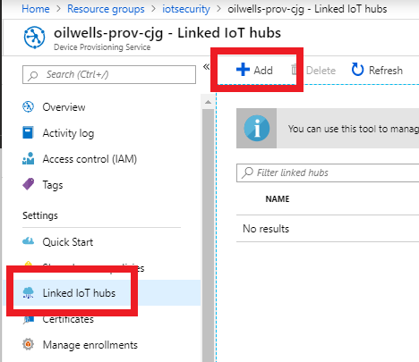
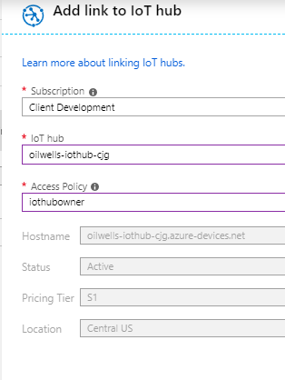
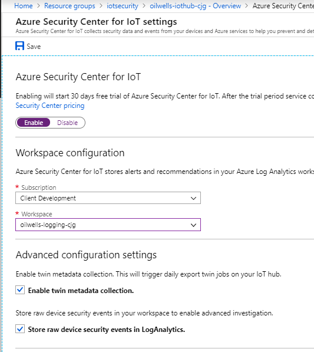
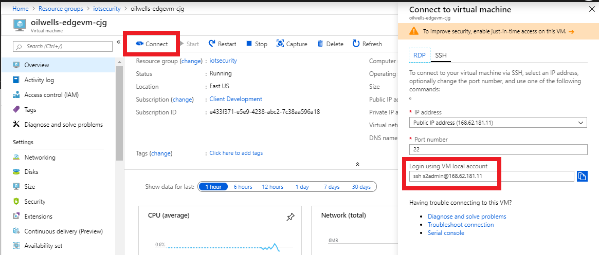
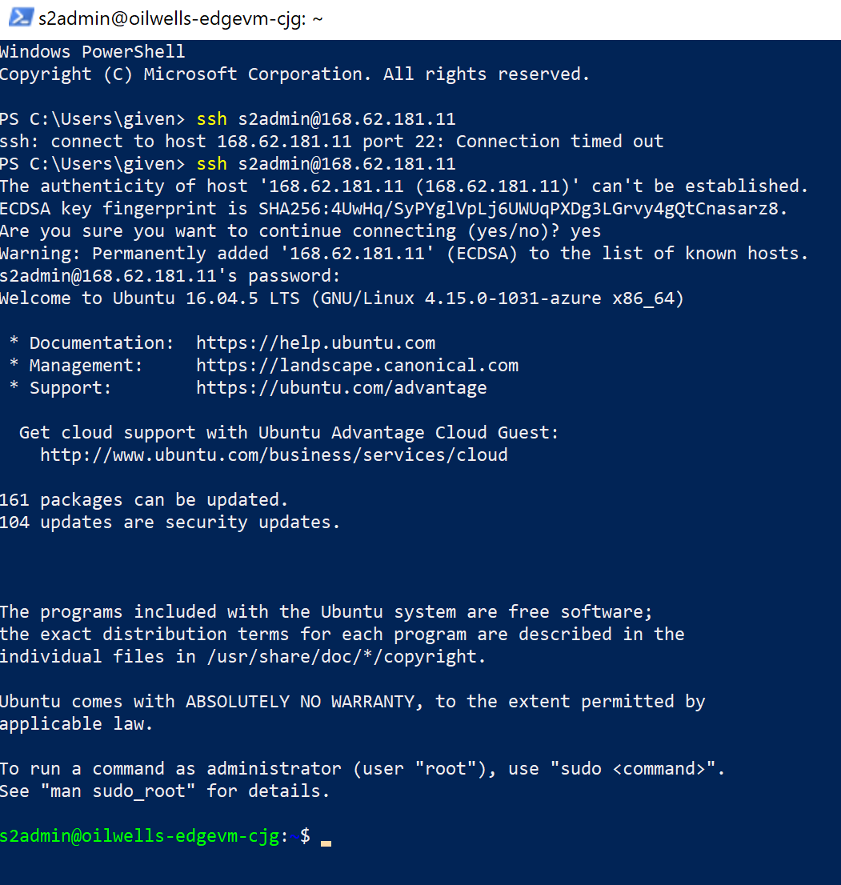
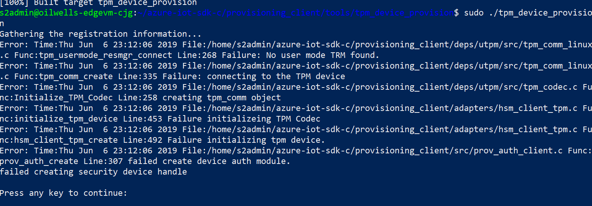
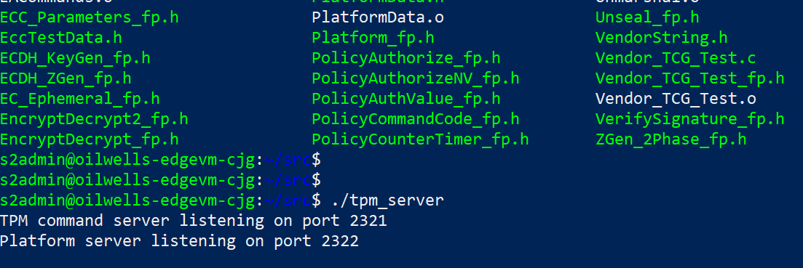
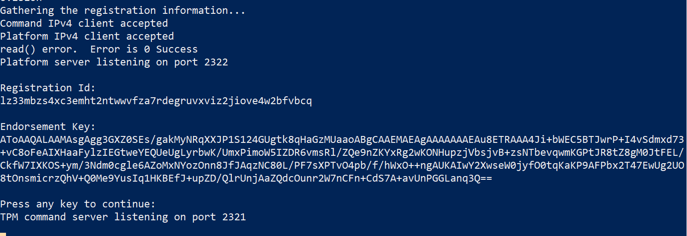
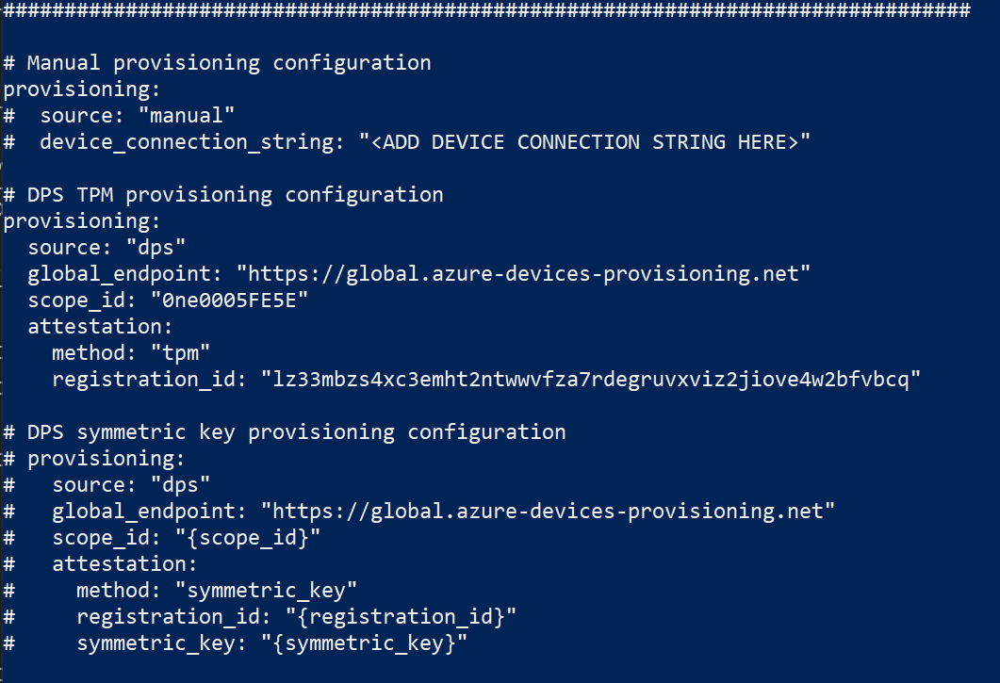
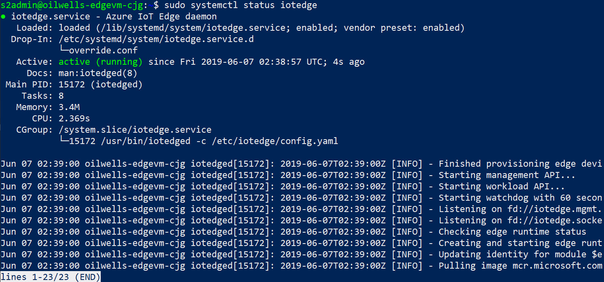

<div class="MCWHeader1">
Securing the IoT end to end
</div>

<div class="MCWHeader2">
Hands-on lab step-by-step
</div>

<div class="MCWHeader3">
June 2019
</div>


Information in this document, including URL and other Internet Web site references, is subject to change without notice. Unless otherwise noted, the example companies, organizations, products, domain names, e-mail addresses, logos, people, places, and events depicted herein are fictitious, and no association with any real company, organization, product, domain name, e-mail address, logo, person, place or event is intended or should be inferred. Complying with all applicable copyright laws is the responsibility of the user. Without limiting the rights under copyright, no part of this document may be reproduced, stored in or introduced into a retrieval system, or transmitted in any form or by any means (electronic, mechanical, photocopying, recording, or otherwise), or for any purpose, without the express written permission of Microsoft Corporation.

Microsoft may have patents, patent applications, trademarks, copyrights, or other intellectual property rights covering subject matter in this document. Except as expressly provided in any written license agreement from Microsoft, the furnishing of this document does not give you any license to these patents, trademarks, copyrights, or other intellectual property.

The names of manufacturers, products, or URLs are provided for informational purposes only and Microsoft makes no representations and warranties, either expressed, implied, or statutory, regarding these manufacturers or the use of the products with any Microsoft technologies. The inclusion of a manufacturer or product does not imply endorsement of Microsoft of the manufacturer or product. Links may be provided to third party sites. Such sites are not under the control of Microsoft and Microsoft is not responsible for the contents of any linked site or any link contained in a linked site, or any changes or updates to such sites. Microsoft is not responsible for webcasting or any other form of transmission received from any linked site. Microsoft is providing these links to you only as a convenience, and the inclusion of any link does not imply endorsement of Microsoft of the site or the products contained therein.

© 2019 Microsoft Corporation. All rights reserved.

Microsoft and the trademarks listed at <https://www.microsoft.com/en-us/legal/intellectualproperty/Trademarks/Usage/General.aspx> are trademarks of the Microsoft group of companies. All other trademarks are property of their respective owners.

**Contents** 

<!-- TOC -->

- [Securing the IoT End to End hands-on lab step-by-step](#\insert-workshop-name-here\-hands-on-lab-step-by-step)
    - [Abstract and learning objectives](#abstract-and-learning-objectives)
    - [Overview](#overview)
    - [Solution architecture](#solution-architecture)
    - [Requirements](#requirements)
    - [Before the hands-on lab](#before-the-hands-on-lab)
    - [Exercise 1: Configure IoT Services](#exercise-1-exercise-name)
        - [Task 1: Task name](#task-1-task-name)
        - [Task 2: Task name](#task-2-task-name)
    - [Exercise 2: Provision devices](#exercise-2-exercise-name)
        - [Task 1: Task name](#task-1-task-name-1)
        - [Task 2: Task name](#task-2-task-name-1)
    - [Exercise 3: Exercise name](#exercise-3-exercise-name)
        - [Task 1: Task name](#task-1-task-name-2)
        - [Task 2: Task name](#task-2-task-name-2)
    - [After the hands-on lab](#after-the-hands-on-lab)
        - [Task 1: Task name](#task-1-task-name-3)
        - [Task 2: Task name](#task-2-task-name-3)

<!-- /TOC -->

# Securing the IoT End to End hands-on lab step-by-step 

## Abstract and learning objectives 

In this hands-on-lab, you will implement an IoT solution that utilizes the latest Azure Security IoT features.  Specifically you will provision a set of Azure resources that will securly manage your IoT infrastructure and devices.  This includes provisioning Azure IoT Edge devices with supporting modules and agents.

Once deployed and configured, you will simulate various events from the devices that will then generate specific alerts in the Azure Security Center for IoT.  You can then use these alerts to diagnosis issues with your devices and execute commands to remediate those issues.

At the end of this lab you will have a better understanding of how the latest Azure Security features work with IoT environments as well as how to install, configure and troubleshoot issues.

## Overview

Contoso, Ltd. has major holdings in one of the world’s most important oil-producing regions. To overcome the challenges of monitoring and optimizing a vast number of widely dispersed field assets, Contoso, Ltd. is looking to streamline its operations with IoT solutions. They want to deploy IoT technologies to electronically collect data and use cloud based solutions to store and analyze it in order to gain new insights into well operations and future drilling possibilities. 

Their environments are very tough environments in which to work. The climate is hot, harsh, and unforgiving, and oil wells are often spaced many miles apart, so field technicians can spend much of their day just driving from one to another. Cellular and radio reception is spotty at best, so collecting data about well conditions and performance typically involves manually writing down information. The technician must then make the long trek to the central office at the end of the day to upload the data for analysis. With such remote situations, a key concern for Contoso is not only how they manage these remote devices, but more broadly how they secure the complete solution that encompasses the physical device, the software on the device, the services processing the data in the cloud and the network connecting it all. 

Contoso plans to tie in to existing sensors at the well head that monitor key system parameters like temperatures, pressures, and flow rates. They will deploy gateway devices to route device data for processing, storage and analytics. Internal IT staff and engineers want to visualize the high-resolution data and deliver near real-time analyses. The company is placing a premium on flexibility and ease of use, with security as a fundamental driver. 

In addition, they would also like the solution to yield benefits to their workers in the field. “The field technicians and lease operators already have tools on their phones that they use every day to see what a well is doing,” explains Miles Strom. “Our goal is to connect these tools to live data from the IoT sensors. So, instead of seeing low-resolution volumes or flow rates, they’ll see what is happening in real time. This way they can respond immediately to problems that lead to downtime or maintenance issues.”

They have implemented a proof of concept solution for collecting and analyzing device telemetry using IoT Hub, but are interested in learning about any related services in Azure that would help them to secure such solutions.

## Solution architecture

\[Insert your end-solution architecture here. . .\]

## Requirements

1. Microsoft Azure subscription must be pay-as-you-go or MSDN.

    - Trial subscriptions will not work.
    
## Before the hands-on lab

Refer to the Before the hands-on lab setup guide manual before continuing to the lab exercises.

## Exercise 1: Configure IoT Services

Duration: 15 minutes

Synopsis:  In this exercise you will link your provisioning service to your IoT Hub.  Once this is completed, you will enable the Azure Security Center for IoT on your IoT Hub.  With this plumbing in place, you can start to create your device enrollments and to provision your IoT devices.

### Task 1: Link Provision Service to IoT Hub

1.  Open the Azure Portal

2.  Select the **oilwells-prov-[YOUR INITS]** resource

3.  In the Device Provisioning Service blade, under **Settings**, select **Linked IoT Hubs**

4.  Click **Add**



5.  Select the **oilwells-iothub-[YOUR INITS]** IoT hub

6.  Select the **iotowner** access policy



7.  Click **Save**

### Task 2: Enable Azure Security Center for IoT

1.  Navigate to your resource group 

2.  In the menu, select the **oilwells-iothub-[YOUR INITS]** IoT Hub

3.  In the resource blade, scroll down to the **Security** section and click **Overview**

4.  In the overview area, click **Start preview**

5.  In the settings, click **Enable**

6.  For the workspace, select **oilwells-logging-[YOUR INIT]**



7.  Click **Save**

## Exercise 2: Enroll and Provision IoT Devices

Duration: 30 minutes

Synopsis: With the Azure resources in place, you can now start creating and provisioning devices into your Azure IoT hub.  Here you will create several devices and configure them with the Azure IoT SDK, agents and modules to allow you to provision and utilize the security services offered by Azure.

### Task 1: Configure your devices

1.  Navigate to your Azure Resource Group

2.  Select the **oilwells-edgevm-cjg**

3.  Click **Connect**



4.  Open a Windows Powershell window, execute the following and copy the SSH details into the window.

5.  When prompted, type **yes** then press **ENTER**

6.  Copy the SSH details, press **ENTER**

7.  When prompetd, enter the password **S2@dmins2@dmin**.  You should now be logged into the device.



### Task 2: Update and install Azure IoT SDK prerequisites

1.  Run the following commands, this could take up to 10 minutes to complete:

```PowerShell
sudo apt-get update
sudo apt-get upgrade

sudo apt-get install -y git cmake build-essential curl libcurl4-openssl-dev libssl-dev uuid-dev

sudo apt-get install libcurl3 libcurl-openssl1.0-dev
sudo apt-get install auditd audispd-plugins

```

### Task 3: Download and compile the Azure IoT SDK

1.  Run the following commands

```PowerShell
git clone https://github.com/Azure/iotedge --recursive

git clone -b 2019-05-16 https://github.com/Azure/azure-iot-sdk-c.git --recursive

cd azure-iot-sdk-c

git submodule update --init

#cmake -Duse_prov_client:BOOL=ON .
cmake -Duse_prov_client:BOOL=ON -Duse_tpm_simulator:BOOL=ON .

cd provisioning_client/tools/tpm_device_provision

make
```

### Task 4: Attempt Device Enrollment 

1.  Run the following commands:

```PowerShell
sudo ./tpm_device_provision
```

>NOTE:  This command will fail on a device that does not have a hardward or software TPM installed



### Task 5: Install a software TPM and Resource Manager and reattempt Device Enrollment

1.  Run the following commands to start a TPM server

```PowerShell
cd

sudo wget -c https://cfhcable.dl.sourceforge.net/project/ibmswtpm2/ibmtpm1332.tar.gz

sudo tar -zxvf ibmtpm1332.tar.gz 

cd src
sudo make

./tpm_server &
```



2.  Run the following commands to start a TPM resource manager:

```PowerShell

cd 

sudo apt-get install autoconf
sudo apt-get install libtool
sudo apt-get install pkg-config

sudo wget -c https://astuteinternet.dl.sourceforge.net/project/ibmtpm20tss/ibmtss1470.tar.gz

sudo tar -zxvf ibmtss1470.tar.gz 

autoreconf -i
./configure --prefix=${HOME}/local --disable-hwtpm
make
make install

cd local/bin
./tsspowerup &
./tssstartup &

```



3.  With your software TPM running, attempt to provision again using the following commands:

```PowerShell
cd
cd azure-iot-sdk-c/provisioning_client/tools/tpm_device_provision
sudo ./tpm_device_provision
```
2.  Copy the device **Registration Id** and the **Endorsement Key**

> NOTE: In the real world all your devices should have hardware based TPMs.

3.  Switch to the Azure Portal and navigate to the Device Provisioning Service **oilwells-prov-[YOUR INIT]**

4.  Under **Settings**, click **Manage enrollments**

5.  Click **Add Individual Enrollment**

6.  Enter your Registration Id and Endorsement Key, then click the **Enable** toggle for the IoT Edge Device setting

7.  Click **Save**

## Exercise 3: Install IoT Edge

Duration: X minutes

\[insert your custom Hands-on lab content here . . .\]

### Task 1: Install IoT Edge

1.  Run the following command:

```PowerShell
curl https://packages.microsoft.com/config/ubuntu/16.04/prod.list > ./microsoft-prod.list

sudo cp ./microsoft-prod.list /etc/apt/sources.list.d/

curl https://packages.microsoft.com/keys/microsoft.asc | gpg --dearmor > microsoft.gpg

sudo cp ./microsoft.gpg /etc/apt/trusted.gpg.d/

sudo apt-get install moby-engine
sudo apt-get install moby-cli

sudo apt-get install iotedge

```

### Task 2: Configure the Iot Edge Agent

1.  Switch to the Azure Portal, open your **oilwells-prov-[YOUR INIT]** resource

2.  In the overview, copy the **ID Scope**

3.  Open the **oilwells-iothub-[YOUR INIT]** IoT Hub.  

4.  Under **Automatic Device Management**, click **IoT Edge**

5.  Click **Add IoT Edge Device**

6.  For the Device Id, type **OilWells001**

7.  Click **Save**, then select the new **OilWells001** item

8.  Copy the primary device connection string

9.  Run the following command to open a text editor:

```PowerShell
sudo nano /etc/iotedge/config.yaml
```

10.  Comment out the manual provision settings, uncomment the **dps** settings, then copy in the Id Scope and Registration Id information:

> NOTE:  Be sure that the leading lines have "tabs" that are made up of only 2 space characters



11.  Although we are using a software TPM, you would need to give permissions to the hardware TPM to the iotedge service by running the following commands:

```PowerShell
tpm=$(sudo find /sys -name dev -print | fgrep tpm | sed 's/.\{4\}$//')

sudo touch /etc/udev/rules.d/tpmaccess.rules
```

12.  Run the following command to open a text editor:

```PowerShell
sudo nano /etc/udev/rules.d/tpmaccess.rules
```

13.  Copy the following into the file:

```
# allow iotedge access to tpm0
KERNEL=="tpm0", SUBSYSTEM=="tpm", GROUP="iotedge", MODE="0660"
```
14.  Execute the following:

```
/bin/udevadm trigger $tpm
```

15.  Run the following command to open a text editor:

```PowerShell
sudo systemctl restart iotedge
sudo systemctl status iotedge
```

16.  You should see the status as **started**.  



> NOTE: If you do not, then run the following command to see diagnostics logs that may help you troubleshoot the issue: 

```PowerShell
sudo journalctl -u iotedge
```

14.  The IoT Edge modules will be downloaded and created in docker containers, you can review the docker images by running:

```PowerShell
sudo docker ps
```

## Exercise 4: Install Azure Security IoT Agent

Duration: X minutes

\[insert your custom Hands-on lab content here . . .\]

### Task 1: Install the Security Agent

1.  Run the following command:

```PowerShell
cd

git clone https://github.com/Azure/Azure-IoT-Security-Agent-C.git --recursive

sudo apt-get install libcurl3 libcurl-openssl1.0-dev
sudo apt-get install auditd audispd-plugins

#extract the release binaries

cd Azure-IoT-Security-Agent-C/binary

sudo tar -zxvf ubuntu-16.04-x64.tar.gz
sudo cp -r agent/Install/. /var/ASCIoTAgent

cd /var/ASCIoTAgent

sudo chmod +x InstallSecurityAgent.sh

sudo ./InstallSecurityAgent.sh -aui Device -aum SymmetricKey -f /var/certs/key -hn oilwells-iothub-cjg.azure-devices.net -di OilWell001 -i

sudo mkdir /var/certs

sudo nano /var/certs/key
```
2.  Copy the primay key from the device and copy it into the file

3.  Run the following command to start the security agent:

```PowerShell
sudo systemctl start ASCIoTAgent
sudo systemctl status ASCIoTAgent
```

### Task 2: Install the IoT Hub Security Agent Module

1.  Switch to the Azure Portal

2.  Open the **oilwells-iothub-[YOUR INIT]** IoT Hub

3.  Click **IoT Edge**

4.  Select the device

5.  Click **Set Modules**

6.  Click **Add**, then select **IoT Edge Module**

7.  For the name, type **azureiotsecurity**

8.  For the Image URI, type:

```
mcr.microsoft.com/ascforiot/azureiotsecurity:0.0.3
```

9.  In the Container Create Options, copy the following:

```
{
    "NetworkingConfig": {
        "EndpointsConfig": {
            "host": {}
        }
    },
    "HostConfig": {
        "Privileged": true,
        "NetworkMode": "host",
        "PidMode": "host",
        "Binds": [
            "/:/host"
        ]
    }
}    
```

10.  Copy the following into the twin's desired properties textarea:

```
{
  "properties.desired": {
    "azureiot*com^securityAgentConfiguration^1*0*0": {
    }
  }
}
```

11.  Click **Save**

12.  Click **Configure advanced Edge Runtime settings**

13.  Change the image name to **mcr.microsoft.com/ascforiot/edgehub:1.0.9-preview**

12.  Click **Next**

13.  On the routes dialog, replace with the following:

```
{
  "routes": {
    "route": "FROM /messages/* INTO $upstream",
    "ASCForIoTToIoTHub" : "FROM /messages/modules/azureiotsecurity/* INTO $upstream"
  }
}
```

14.  Click **Next**

15.  Click **Submit**

## Exercise 5: Simulate IoT Attacks

Duration: X minutes

\[insert your custom Hands-on lab content here . . .\]

### Task 1: Setup the Attack scripts

1.  Run the following command:

```
sudo apt-get install netcat
```

2.  Download and execute the attack script:

```
cd

git clone https://github.com/Azure/Azure-IoT-Security --recursive

cd Azure-IoT-Security/trigger_events

sudo chmod +x trigger_events.sh

sudo ./trigger_events.sh --exploit

sudo ./trigger_events.sh --malicious

```

## Exercise 6: Configure Security and Alerts

Duration: X minutes

\[insert your custom Hands-on lab content here . . .\]

### Task 1: Configure Diagnostic Logging on IoT Hub

1.  Open your Azure Portal

2.  Click the **oilwells-iothub-[YOUR INIT]** IoT hub

3.  Click **Diagnostic settings**

4.  Click **Add diagnostic setting**

5.  For the name, type **oilwells-iothub-logging**

6.  Check the **Send to Log Analtyics** checkbox, and then select the **oilwells-logging-[YOUR INIT]** workspace

7.  Check all the LOG checkboxes

8.  Click **Save**

### Task 2: Configure Diagnostic Logging on Device Provisioning Service

2.  Click the **oilwells-prov-[YOUR INIT]** IoT hub

3.  Click **Diagnostic settings**

4.  Click **Add diagnostic setting**

5.  For the name, type **oilwells-prov-logging**

6.  Check the **Send to Log Analtyics** checkbox, and then select the **oilwells-logging-[YOUR INIT]** workspace

7.  Check all the LOG checkboxes

8.  Click **Save**

> NOTE:  It may take 5-10 minutes for event data to populate into the Log Analytics and then for Security Center recommendations to display

### Task 3: Review Security Log Data

1.  Open your Azure Portal

2.  Click the **oilwells-iothub-[YOUR INIT]** IoT hub

3.  Click **Overview**, you will get a dashboard of potential security recommendations that very likey should be implemented.

4.  Click **Recommendations**, you should see our attack items displaying:

5.  Click the **Open Ports On Device** recommendation.  In the dialog, click the **To see which devices have this recommendation...** link.  This will navigate to the Log Analytics portal when you can drill deeper into the log data that caused the alert.

6.  Expand the log, 

### Task 4: Create Custom Security Alerts

1.  Open your Azure Portal

2.  Click the **oilwells-iothub-[YOUR INIT]** IoT hub

3.  Click **Custom Alerts**

4.  Click **default**

5.  Click **Add a custom alert**

6.  Review the available options, then select **Number of failed local logins is not in allowed range**

7.  Click **Ok**, then click **Save**

## After the hands-on lab 

Duration: 10 minutes

In this exercise, attendees will deprovision any Azure resources that were created in support of the lab.

### Task 1: Delete resource group

1.  Using the Azure portal, navigate to the Resource group you used throughout this hands-on lab by selecting **Resource groups** in the menu.

2.  Search for the name of your research group, and select it from the list.

3.  Select **Delete** in the command bar, and confirm the deletion by re-typing the Resource group name and selecting **Delete**.

You should follow all steps provided *after* attending the Hands-on lab.

