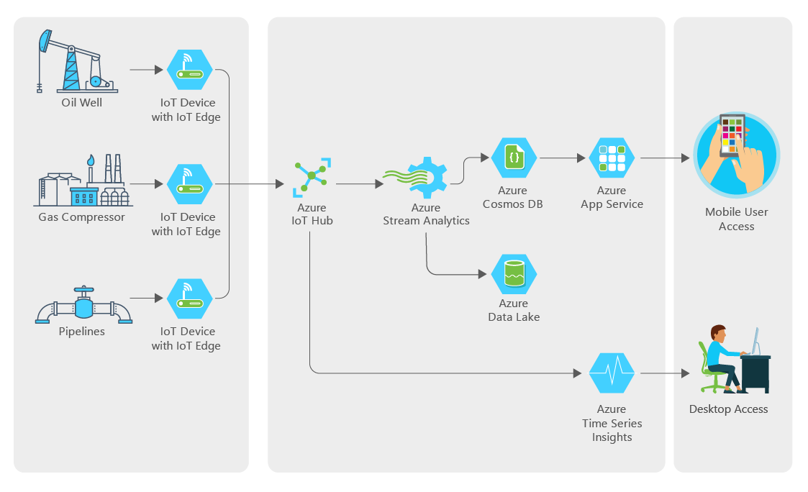

# Securing the IoT end-to-end
Contoso, Ltd. has major holdings in one of the world’s most important oil-producing regions. To overcome the challenges of monitoring and optimizing a vast number of widely dispersed field assets, Contoso, Ltd. is looking to streamline its operations with IoT solutions. They want to deploy IoT technologies to electronically collect data and use cloud based solutions to store and analyze it in order to gain new insights into well operations and future drilling possibilities. 

Their environments are very tough environments in which to work. The climate is hot, harsh, and unforgiving, and oil wells are often spaced many miles apart, so field technicians can spend much of their day just driving from one to another. Cellular and radio reception is spotty at best, so collecting data about well conditions and performance typically involves manually writing down information. The technician must then make the long trek to the central office at the end of the day to upload the data for analysis. With such remote situations, a key concern for Contoso is not only how they manage these remote devices, but more broadly how they secure the complete solution that encompasses the physical device, the software on the device, the services processing the data in the cloud and the network connecting it all. 

Contoso plans to tie in to existing sensors at the well head that monitor key system parameters like temperatures, pressures, and flow rates. They will deploy gateway devices route device data for processing, storage and analytics. Internal IT staff and engineers want to visualize the high-resolution data and deliver near real-time analyses. The company is places a premium on flexibility and ease of use, with security as a fundamental. 

In addition, they would also like to the solution to yield benefits to their workers in the field. “The field technicians and lease operators already have tools on their phones that they use every day to see what a well is doing,” explains Miles Strom. “Our goal is to connect these tools to live data from the IoT sensors. So, instead of seeing low-resolution volumes or flow rates, they’ll see what is happening in real time. This way they can respond immediately to problems that lead to downtime or maintenance issues.”

They have implemented proof of concept solution for this collecting and analyzing device telemetry using IoT Hub, but are interested in learning about any related services in Azure that would help them to secure such solutions. 

## Target audience
-	Cloud Solution Architect
-   System Architect
-   Software Engineer
-   Technical Support Engineer
-   Data Engineer

## Abstract

### Workshop
In this workshop, you will look at the process for designing and implementing an oil and gas manufacturing IoT solution that is secured end-to-end following best practices. 

At the end of this workshop, you will be better able to architect a comprehensive and secure oil and gas manufacturing IoT solution.

### Whiteboard design session
In this whiteboard design session, you will look at the process for designing a oil and gas manufacturing IoT solution that is secured end-to-end following best practices. You will learn how how to monitor and manage the security of all components in the solution You will also provide Contoso guidance on defining lifecycles for particular components so that they have a plan that begins with initial deployment, to expected maintenance, to planned obsolescence and ultimately thru decommissioning of the device so that they can understand how Azure supports this. Additionally, you will perform some threat modeling to help Contoso think about how they might handle STRIDE threats (spoofing of user identity, tampering, repudiation, information disclosure, denial of service, elevation of privilege).  

At the end of this whiteboard design session, you will be better able to architect a comprehensive and secure oil and gas manufacturing IoT solution.

#### Outline: Key Concerns for Customer situation ####
- How can we provide a secure identity to each of our devices?
- How can we proactively guard against attacks to components in our solution, from device, to network to cloud? 
- What is the alerting capability provided? Do we have to author dozens of rules to get started? How would we keep the rules set up to date? Are we limited to rules as the only way alerts are created?
- Are the alerts limited to events occurring just on the device or can we have a single solution that can raise alerts based on events transpiring on devices, on our IoT Edge devices, and the IoT Hub to which they transmit?
- Is there a way for us to send custom security related events from the device? Can this be done without an agent installed on the device?
- How can we manually query for security alerts collected by the solution?
- How do we manage the lifecycle of the solution, encompassing the both the applications running on or near the device and in the cloud?
- We run a mix of devices, mostly Linux but some run on x86 and others run on x64 architectures. When using Azure Security Center for IoT, how would we choose the agent flavor to use? We currently do not have Windows Server or Windows IoT Core devices, but as we are exploring new devices all the time, we are curious- do the Windows agents and Linux agents have feature parity?
- How do we configure IoT Hub to enable the additional security capabilities?
- How are security agents installed on the devices? Do we have to install the agents one by one or are there ways for us to deploy at scale? Can we turn the device agent off, such as when we need to perform maintenance on the device?
- How do we configure a security module on our IoT Edge device?
- How does my solution architecture change if I use multiple different IoT Hubs instead of one central IoT Hub?
- For the security solution you recommend, are there communication protocols are we required to use for the devices and for IoT Edge devices?
- We understand now that Azure Security Center for IoT provides the capabilities to secure solutions around a single IoT Hub. If we want to roll this security info up to a higher, enterprise wide view across other IoT Hub solutions, or to include non-IoT solutions in a unified security information and event management solution or leverage security orchestration and automated response at this higher level, what other Azure service should we consider and how at a high level would we configure it to consume the events from ASC for IoT?

### Hands-on lab 
In this hands-on lab, you will look at the process for implementing a oil and gas manufacturing IoT solution that is secured end-to-end following best practices. You will learn how how to monitor and manage the security of all components in the solution. 

#### Outline: Hands-on lab exercises
- Exercise 0: Before the hands-on lab
- Exercise 1: Secure IoT Hub 
- Exercise 2: Secure Device  
- Exercise 3: Secure IoT Edge
- Exercise 4: Send custom security events
- Exercise 5: Query and monitor events, alerts and recommendations
- Exercise 6: Simulate an attack and perform threat mitigation

## Azure services and related products
-	Azure Security Center (including ASC for IoT)
-   Log Analytics
-   Azure IoT Provisioning Service
-	Azure IoT Edge
-	Azure IoT Hub

## Related references
- [MCW](https://github.com/Microsoft/MCW)
- https://docs.microsoft.com/en-us/azure/asc-for-iot/overview
- https://docs.microsoft.com/en-us/azure/iot-fundamentals/iot-security-architecture 
